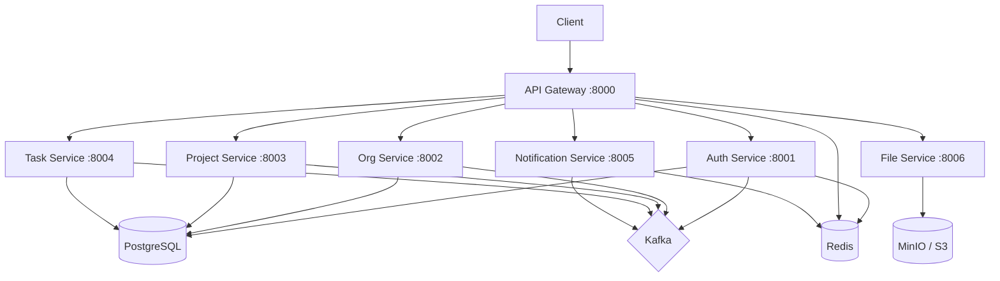

# Enterprise Task & Project Management SaaS

## Overview

A complete **microservices-based Task & Project Management SaaS platform** built with 7 services, a shared library, and Docker infrastructure.

## Architecture



## Services

| Service | Port | Key Features |
|---------|------|-------------|
| **API Gateway** | 8000 | Reverse proxy, JWT validation, rate limiting, org header injection |
| **Auth** | 8001 | Register, login, RS256 JWT, refresh tokens, Redis blacklisting |
| **Organization** | 8002 | Org CRUD, members with roles, teams, team memberships |
| **Project** | 8003 | Project CRUD, templates, memberships, custom Kanban statuses |
| **Task** | 8004 | Task CRUD, sub-tasks, dependencies, comments, time tracking, views |
| **Notification** | 8005 | Kafka consumer, WebSocket real-time, notification preferences |
| **File** | 8006 | MinIO upload, file versioning, pre-signed download URLs |

## Shared & Core Libraries

- **Config**: Centralized `BaseServiceSettings` with Pydantic Settings
- **Database**: Async SQLAlchemy engine/session factory (`DatabaseSessionManager`)
- **Auth**: RS256 JWT creation/verification, `get_current_user` dependency factory
- **RBAC**: `OrgRole`/`ProjectRole` enums, permission matrix, FastAPI dependency factories
- **Events**: Kafka producer/consumer helpers, topic/event type constants
- **Middleware**: `OrgScopingMiddleware` for multi-tenancy

## Key Design Decisions

- **Database-per-service** for strong isolation
- **RS256 JWT** with separate access/refresh tokens
- **Kafka** for async inter-service events
- **Redis Pub/Sub** for WebSocket real-time notifications
- **MinIO** (S3-compatible) for file storage with versioning
- **Sliding window rate limiting** in the gateway via Redis sorted sets

## Project Structure

```
Task_project_management_saas/
├── docker-compose.yml
├── .env.example
├── scripts/init-databases.sql
├── keys/ (private.pem, public.pem)
├── shared/
│   └── shared/ (config, database, auth, events, middleware, models)
└── services/
    ├── api_gateway/
    ├── auth_service/
    ├── org_service/
    ├── project_service/
    ├── task_service/
    ├── notification_service/
    └── file_service/
```
