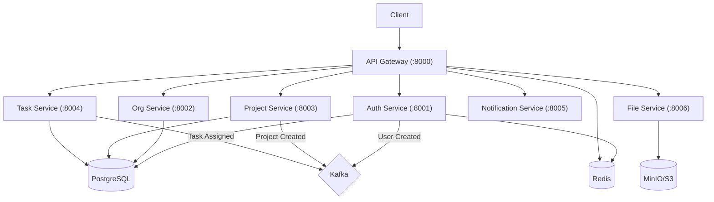

# Enterprise Task & Project Management SaaS

A scalable, microservices-based SaaS platform for enterprise task and project management, built with Python (FastAPI), Kafka, and Docker.

## 🚀 Features

### Core
- **Multi-Tenancy**: Organization-based data isolation with `org_id` scoping
- **Authentication**: Secure registration, login, and RS256 JWT-based auth with refresh tokens
- **RBAC**: Fine-grained permissions for Organizations (Admin/Member) and Projects (Owner/Admin/Manager/Member/Viewer)

### Project Management
- **Projects**: Create projects, clone from templates, manage members
- **Tasks**: Hierarchical tasks (sub-tasks), dependencies, priority levels, and due dates
- **Views**: Kanban board with drag-drop reordering, Gantt charts, and Calendar views
- **Customization**: Custom Kanban statuses per project

### Collaboration
- **Comments**: Threaded discussions with `@mention` support
- **Time Tracking**: Manual time logging and start/stop timers
- **Files**: Secure file upload (min.io/S3) with versioning and pre-signed download URLs
- **WebSockets**: Real-time notifications for task assignments and updates

## 🏗 Architecture

The platform follows a **Database-per-Service** pattern with event-driven communication via Kafka.



### Services Overview

| Service | Port | Database | Responsibilities |
|---------|------|----------|------------------|
| **API Gateway** | 8000 | Redis | Entry point, Auth check, Rate limiting, Routing |
| **Auth** | 8001 | `auth_db` | Users, JWT issuance, Password reset |
| **Organization** | 8002 | `org_db` | Organizations, Teams, Org Memberships |
| **Project** | 8003 | `project_db` | Projects, Templates, Project Roles |
| **Task** | 8004 | `task_db` | Tasks, Sub-tasks, Time logs, Comments |
| **Notification** | 8005 | `notif_db` | In-app notifications, WebSocket delivery |
| **File** | 8006 | `file_db` | File metadata, S3 integration |

## 🛠 Getting Started

### Prerequisites
- Docker & Docker Compose
- Python 3.11+ (for local development)

### Quick Start

1. **Clone the repository**
   ```bash
   git clone https://github.com/JohnOlorunsogo/Task-and-Project-Management-SaaS.git
   cd Task-and-Project-Management-SaaS
   ```

2. **Generate Keys**
   Generate RS256 keys for JWT signing:
   ```bash
   mkdir -p keys
   openssl genrsa -out keys/private.pem 2048
   openssl rsa -in keys/private.pem -outform PEM -pubout -out keys/public.pem
   ```

3. **Environment Setup**
   Copy the example environment file:
   ```bash
   cp .env.example .env
   ```

4. **Launch with Docker Compose**
   ```bash
   docker-compose up -d --build
   ```
   This will start:
   - PostgreSQL (port 5432)
   - Redis (port 6379)
   - Kafka + Zookeeper (port 9092)
   - MinIO (port 9000/9001)
   - All 7 API services

5. **Verify Installation**
   Check the API Gateway health:
   ```bash
   curl http://localhost:8000/health/services
   ```

## 📚 API Documentation

Once running, access the automatic Swagger UI docs for each service:

- **Gateway**: http://localhost:8000/docs
- **Auth**: http://localhost:8001/docs
- **Org**: http://localhost:8002/docs
- **Project**: http://localhost:8003/docs
- **Task**: http://localhost:8004/docs

Authentication follows the `Bearer <token>` standard. Obtain a token via `POST /api/v1/auth/login`.

## 🧪 Development

### Running Local Database Migrations
We use Alembic for migrations. To run them locally:

```bash
# Example for Auth Service
cd services/auth_service
alembic upgrade head
```

### Shared Library
Common code (models, utils) resides in `shared/`. If you modify it, rebuild the containers:
```bash
docker-compose build
```
